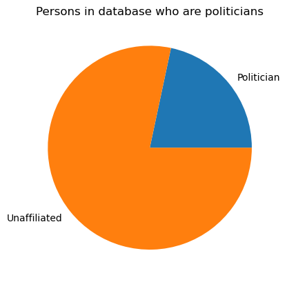
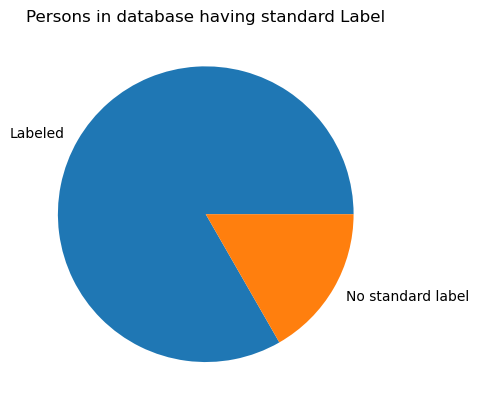
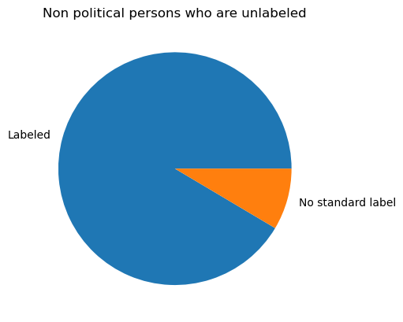
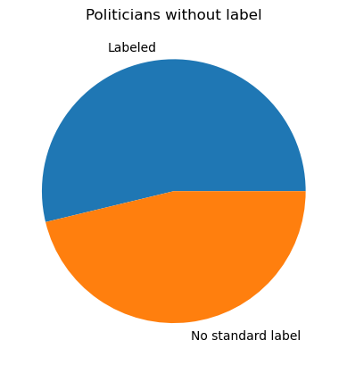

## Ovládání

Pro usnadnění práce s pipelinama, se zde v základním adresáři nachází
několik bash scriptů, ty jsou momentálně relevantní pouze pro používání
soboru *preprocessing.ipynb*, kde je potřeba zapnout několik rest
serverů. Initializace vypadá následovně:

1. Nainstalujte si potřebné balícky pythonu (vše v requirements.txt +
    jupyter)
2. použijte *bash build.sh* pro sestavení rest server executable a
    jejich modelů
3. použijte *bash morphodita.sh* a *sudo bash korektor.sh* (korektor
    vyžaduje superuser privilegia, jinak se nedokáže spustit)
4. Zapněte jupyter notebook proccessing.ipynb

## Preproccessing

Napříč úkolem byla největším problémem vysoká dimensionalita dat,
především velké množství popisků, které buď nepřidávali hodnotu žádnout,
nebo se jednalo o překlepy, či gramatické chyby popřípadě jiný tvar,
nebo druh slova uznačující stejnou informaci. (umělec x umělkyně,
organizovat x organizovaný,...) Cílem preproccessingu tudíž bylo
především se zbavit těchto záznamů s minimální ztrátou informace, k tomu
jsem použil následující pipelinu.

Jejími hlavními částmi je *correct_grammar*, která odstraňuje překlepy a
gramatické chyby, které se v databázy ukázali a *get_roots*. Ta zase
sjednocuje všechna slova se stejným původním kořenem, což většinou jsou
i slova s podobným významem.

Ostatní kroky slouží hlavně k tomu, aby data co tyto dvě funkce
dostávají, bylo jima dobře použitelná, celá pipelina vypadá takto:

1. lower: zmenší všechen text na formát malého písma. Tohle bredevším
    slouží pro sjednocenní slov, které byly zadány jinak pouze podle
    velikosti písma
2. remove_interpuctions: odstraní všechna interpunkční znaménka a
    nahradí je jedním separatórem
3. split_into_words: rozdělí záznamy jednotlivých osob na oddělená
    slova dle seperátoru
4. remove_empty: odstránní prázdné záznamy, způsobeny například
    existencí dvou separátorů vedle sebe
5. unify_parties: nahradí všechna označení politické príslušnosti
    slovem strana
6. remove_shortened_words: nahradí zkratky často opakované v datech,
    jejich celými označeními
7. remove_numbers: odstraní všechny položky obsahující čísla
8. correct_grammar: opraví gramatické chyby v datech
9. lower_l: zase zmenší velká písmená na malá, jelikož correct_grammer
    opravuje i problémy týkající se velikosti písma
10. remove_stop_words: odstraní stop_words, tedy slova s minimální
    přidanou hodnotou, co se informace týče
11. *get_roots:*za pomocí morfologických pravidel uřčí původní kořen
    předka slova, tento krok je ten hlavní krok pro redukci
    dimensionality, a extrémně redukuje počty unikátních slov

Dále vytvářím jiný sloupec, kde byl při spracování dat nahrazen krok 11.
get_roots nahrazen, lemmatizate, který používá lemmatizer majka pro
lemmatizaci. Tento sloupec není používán pro strojové učení, ale jen pro
orientaci, jelikož get_roots silně mění tvary slov tak, že nemusí být
poznat o jaké slovo se původně jednalo.

## Analýza

Po vyčištění dat je v analysis*.ipynb* analýza dat. U záznamu si jde
všimnout několik specifických vlastností. Nejprve, přibližně 75 %
záznamů je bez politické příslušnosti, zatímco zbytek patří mezi členy
jednotlivých stran:

Dále pouze málá část záznamů
nemá žadné standartní označení, více jak 75 % označení má

Toto ovšem začne být zajímavější pro rozdělení podle politické
příslušnosti, protože jak je možno vidět, zatímco valná většína
politicky nezařazených lidí má označení strany.

U lidí, kteří jsou členy některé strany, je téměř polovina bez
standartního označení

Jak lze vidět lidé v
politických stranách mají vyšší potřebu označení než lidé mimo strany.

## Model

Samotný model byl nakonec, z důvodu silné rozdílnosti politicky
angažovaných a neangažovaných lidí trénován jako dva samostatné modely.
Oba mají jednotlivě více než patnáct kategorií a tudíž je nebudu zde
všechny vyčítat. Samotné dokončené modely jsou následně uloženy pomocí
*pickle* do adresáře *model*

Model označující nepolitické má problém se spojování několika kategoríí
do jedné velké. Mezitím model pro politické záznamy, které labelovaní
potřebují více funguje lépe a dokáže dobře rozdělit různé podtypy lidí,
učinkojící v různých politických spektrech. Popřípadně lidi, kteří jsou
označeni jako politici jen tak mimochodem, například umělce.

## Doporučení

Jako první taková z počátku nejsnadněji proveditelná věc, by bylo
nasazení čistící pipeliny k vyhledávání v databázi. Toto především
eliminuje nemožnost najít osobu kvůli překlepu v label nebo označení,
které je pohlavně přechýleno. Co se týče získaného modelu, tak
nejrozumnější mi přijde, přidat do databáze políčko s kategoríí daného
záznamu a umožnit lidem filtrovat politiky a nepolitiky podle jejich
kategorií.
